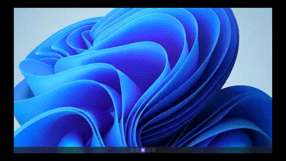

# ChattyWrity

ChattyWrity is a Windows desktop app for voice dictation. Press Ctrl+Space to start speaking, and it transcribes your audio locally using Whisper, then types the result into whichever window you have open.

## What It Does

The app runs in background on Windows. When you hit the global hotkey, a pill-shaped overlay appears at top of your screen showing recording status. The app detects which window you have active and shows that application's icon in the overlay.

All transcription happens on your machine using Whisper (GGML quantized format). It uses Whisper.cpp through native C++ bindings, which will use CUDA if you have an NVIDIA GPU. No audio is sent anywhere - it's entirely local.

## How to Use

1. Press `Ctrl+Space` to start recording
2. Speak what you want to type
3. Wait for transcription
4. The app types the processed text into your active window

The overlay shows the active app's icon on the right side.

## Features

### Active App Detection

The app detects which window is currently active and shows its icon in the overlay. This lets you confirm where your text will be inserted.

### Text Processing

The app processes your speech in several ways. You can configure these options in Settings:

- **Filler removal**: Removes words like "um", "uh", "like", "basically"
- **Auto punctuation**: Converts spoken words to punctuation - "period" becomes ".", "comma" becomes ",", "question mark" becomes "?"
- **Code mode**: Converts spoken terms to programming syntax - "equals" becomes "=", "plus" becomes "+", "bracket" becomes "[" or "]"
- **Capitalization**: Automatically capitalizes the first letter of sentences

### Dictionary

Add custom words that Whisper might mishear. This improves accuracy for names, jargon, or project-specific terms. You can add words from the Settings window.

### Voice Snippets

Create shortcuts where saying a short phrase expands to longer text. Examples include "my email" to insert your email address, or "sign off" to add your signature. Configure these in Settings.

### Per-App Styles

Configure different text formatting for different applications. For example, set formal mode for email apps, casual mode for chat apps, or code mode for IDEs. This adjusts the tone automatically based on what you're using.

Built-in support includes VS Code, Cursor, Outlook, Slack, Discord, Telegram, Teams, and others. Add custom rules in Settings.

### Startup

Right-click the tray icon to enable "Start on Boot" so the app runs automatically when Windows starts.

## Development

### What You Need

- Node.js 18 or newer
- Visual Studio Build Tools with C++ workload
- Windows 10/11 SDK
- Git

### Getting Started

1. Clone repository:
```bash
git clone https://github.com/aymaneelfahsi1/chattywrity/
cd chattywrity
```

2. Install dependencies:
```bash
npm install
```

Note: If this fails with node-gyp errors, check your Visual Studio Build Tools installation.

3. Download Whisper model:
- Create a `models/` folder in the project root
- Download `ggml-small.en-q8_0.bin` from [HuggingFace](https://huggingface.co/ggerganov/whisper.cpp/tree/main)
- Place the `.bin` file in `models/`

### Running

Development mode:
```bash
npm run dev
```

This compiles TypeScript, copies HTML and CSS files, and starts Electron.

### Building

Create a Windows installer:
```bash
npm run build
```

The installer ends up in the `dist/` folder.

### Code Structure

**Main Process** (`src/main/`):
- `index.ts`: Electron setup, window creation, global hotkey registration
- `stateManager.ts`: Recording state, microphone detection via FFmpeg, silence detection
- `transcriber.ts`: Whisper.cpp interface for transcription
- `textInjector.ts`: Uses robotjs to paste text into active application
- `styleManager.ts`: Active window detection, app icon extraction
- `aiProcessor.ts`: Text cleanup and formatting
- `snippetManager.ts`: Voice snippet expansion
- `dictionaryManager.ts`: Custom vocabulary storage
- `startupManager.ts`: Registry edits for startup

**Renderer Process** (`src/renderer/`):
- Overlay UI with audio visualization
- Settings window with tabs for configuration

### Dependencies

- `electron`: Desktop app framework
- `nodejs-whisper`: Whisper.cpp bindings for transcription
- `ffmpeg-static`: Audio recording
- `robotjs`: Keyboard simulation
- `active-win`: Active window detection
- `winreg`: Startup registry management

## GPU Acceleration

If you have an NVIDIA GPU with proper drivers, Whisper.cpp will use CUDA automatically. No configuration needed.

## Configuration

Access Settings from the system tray menu (right-click the tray icon).

**Tabs:**
- Dictionary: Add custom words and corrections
- Snippets: Create voice shortcuts
- Styles: Configure per-app formatting rules
- General: Toggle processing options

All options are saved and persist between sessions.

## Demo



## License

GNU General Public License v3.0 (GPLv3)
